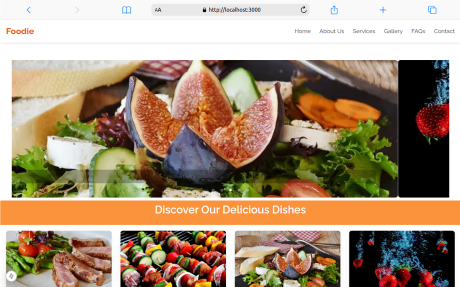
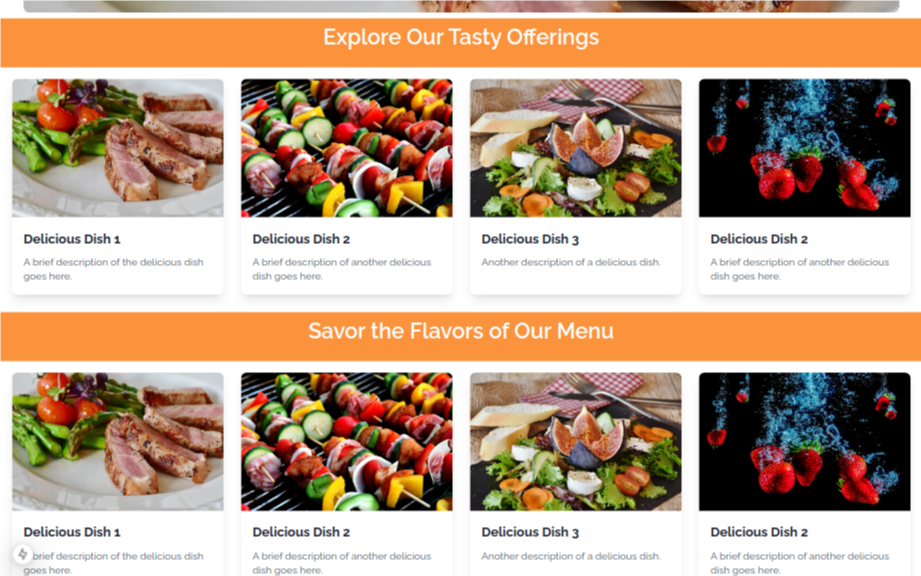
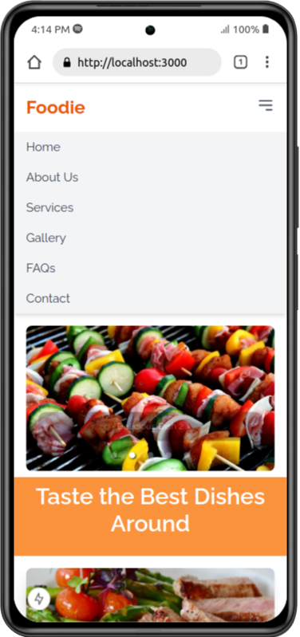

# Foodie - Discover Delicious Dishes

Welcome to **Foodie**, a delightful web application that helps you explore a variety of mouthwatering dishes, their details, and more! Built with **Next.js**, this project aims to provide a seamless and responsive browsing experience for food lovers.



## Features

- **Delicious Dishes**: Browse a variety of dishes, each with images, descriptions, and more.
  
  

- **Randomized Titles**: Enjoy engaging, random titles for a dynamic experience.

- **Responsive Design**: Optimized for various screen sizes and devices.
  
  

- **Smooth Scroll Animations**: Sections become visible when you scroll, adding to the user experience.

- **Easy-to-Use Interface**: Clean and intuitive design for effortless navigation.

## Getting Started

To get started with **Foodie**, follow these steps:

### Prerequisites

Make sure you have the following installed on your system:
- [Node.js](https://nodejs.org/) (v14.0 or above)
- [npm](https://npmjs.com/) (or `yarn`, `pnpm`, or `bun`)

### 1. Clone the Repository

Clone the project repository to your local machine:

```bash
git clone https://github.com/your-username/foodie.git
